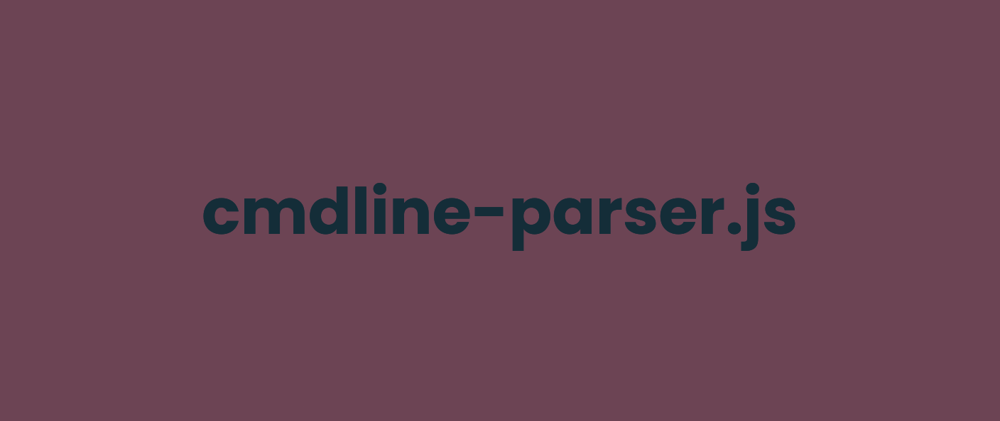

# CmdLineParser.js

cmdline-parser.js is a tool allowing you to retrieve all the information and components of a command line 🐚



# Features ✨

- Can parse multiple commands
- Can parse quotes in arguments
- Supports multiple tokens 
    - `>`, `>>`, `<`, `<<`, `|`, `||`, `&&`
- Supports node.js and browser
- Supports multiple parser instances
- Supports custom parser settings (disable tokens...)

# JsDelivr

```html
<script src="https://cdn.jsdelivr.net/gh/SkwalExe/cmdline-parser.js@v0.2.1/dist/cmdlineparser.min.js"></script>
```

# NPM module 

Install the npm module 

```bash
npm install cmdline-parser
```

And import it in your project 

```js
const CmdLineParser = require('cmdline-parser');

let myParser = new CmdLineParser();
```

# Setting up 

You can import the library into you website with [JsDelivr](#JsDelivr) or, you can use the [npm module](#NPM-module) and import it in your project.

# Parsing your first commands ✨

### Parsing a command line

```js
let command = "echo Hello; echo World";
let parsed = myParser.parse(command);
```

The `parse` method returns an array of `Command`s (because a command line can contain multiple commands `command1; command2`).

### Parsing a single command 

```js 
let command = "echo Hello";
let parsed = myParser.parseCommand(command);
```

The `parseCommand` method returns a `Command` object.

### Parsing arguments

You can get an array of arguments from a string using the `parseArgs` method:

```js
let args = myParser.parseArgs("echo 'Hello World' Hello universe");
// ['echo', 'Hello World', 'Hello', 'universe']
```

**Supports quotes ✨**

# The Command object

The `Command` object is a representation of a command and has the following properties:

- `invalid`: `true` if the command is invalid (for example if quotes are not closed)
- `invalidReason`: the reason why the command is invalid as a string
- `args`: array of arguments passed to the command
- `name`: the name of the command
- `text`: the original command line

We also parse redirectors etc like `>`, `>>`, `<`, `<<`, `|`, `||`, `&&` inside the corresponding token

Example 

```js
let command = myParser.parseCommand("echo 'Hello World' > file.txt && echo 'Hello universe'");

console.log(command[">"]); // [ 'file.txt' ]
console.log(command["&&"]); // Command { name: 'echo', ... }
```

# final

If you have any problem, don't hesitate to open an issue

# contributing

1. Start by [**forking** this repository](https://github.com/SkwalExe/cmdline-parser.js/fork)

2. Then clone your fork to your local machine.
  ```git
  git clone https://github.com/your-username/cmdline-parser.js.git
  ```

3. Install dev dependencies
  ```npm
  npm install --save-dev
   ```

4. Create a new branch
  ```git
  git checkout -b super-cool-feature
  ```

5. Then make your changes

6. Update the changelog and version number if needed (using [Semantic Versioning](https://semver.org)) 
  ```bash
  # bug fix
  npm version patch --no-git-tag-version

  # add a new feature 
  npm version minor --no-git-tag-version
  
  # changes that break backwards compatibility
  npm version major --no-git-tag-version
  ```

7. List and correct linting errors
  ```bash
  npm run lint
  ```

8. Update the minified/browser version of the library
  ```bash
  npm run build
  ```

9. Once you're done, commit your changes and push them to the remote repository.
  ```git
  git add --all
  git commit -m "Add super-cool-feature"
  git push origin super-cool-feature
  ```

10. Then, open a pull request on GitHub from your fork.
   1. Go to [this link](https://github.com/SkwalExe/cmdline-parser.js/compare/)
   2. Click compare across forks
   3. On the right, on `head repository` select your fork
   4. And on `compare` select the branch you just created
   5. Click on `Create Pull Request` and submit your pull request

<a href="https://github.com/SkwalExe#ukraine"></a>